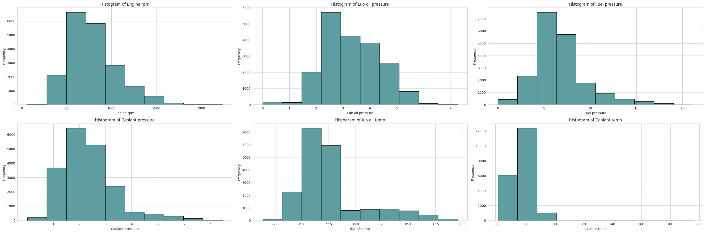
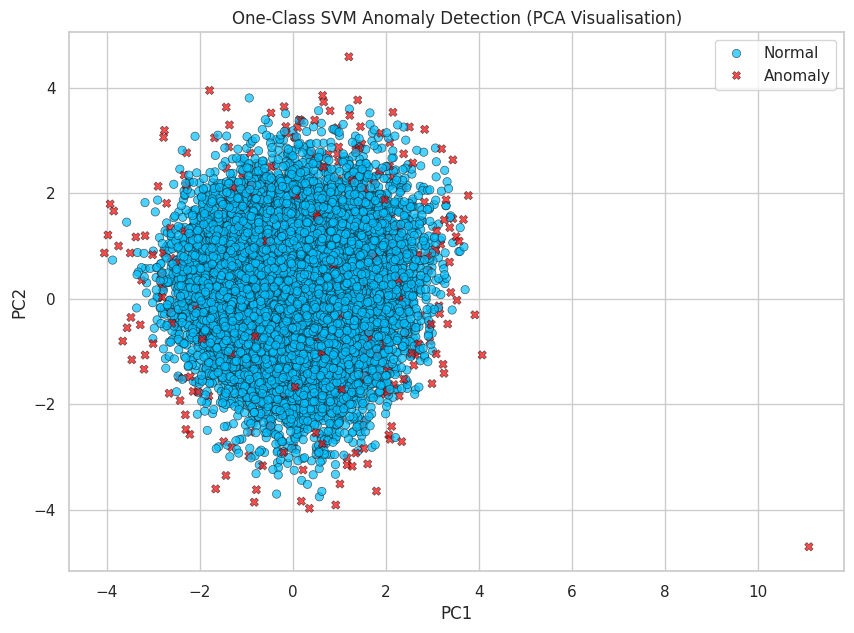
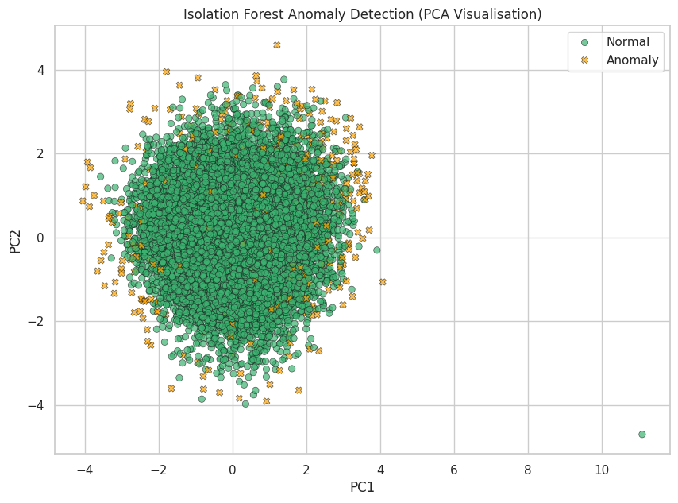

# Detecting Anomalous Activity of a Ship Engine

## 1. Exploratory Data Analysis (EDA)

- Dataset: 19,535 entries, 6 features related to ship engine performance:
  - Engine rpm
  - Lubrication oil pressure
  - Fuel pressure
  - Coolant pressure
  - Lubrication oil temperature
  - Coolant temperature

- Data quality: No missing values or duplicates.

- Initial observations:
  - Features show high variability.
  - Some distributions are skewed with outliers, e.g., fuel pressure.
  - Suggests anomalies may be better detected by considering feature interactions rather than individual thresholds.

- Calculated 95th percentiles for fuel pressure (12.21) and lubrication oil temperature (84.94), with roughly 977 data points beyond these values for each.

- Visualized data distributions using histograms and boxplots to confirm non-normality, supporting non-parametric methods like IQR for anomaly detection:

## 2. Interquartile Range (IQR) Analysis

- Computed Q1, Q3, and IQR for each feature.
- Flagged data points outside Q1 - 1.5*IQR and Q3 + 1.5*IQR as outliers.
- Considered a row anomalous if two or more features were flagged.
- Resulted in 2.16% anomalies, within the expected 1–5% range.
- Tested alternate thresholds (at least one anomaly: 23.72%, at least three: 0.06%), confirming 2.16% as a balanced choice.
- Advantage: straightforward and does not assume normality.

## 3. One-Class SVM Machine Learning

- Applied One-Class SVM for anomaly detection where anomalies aren’t clearly defined.
- Scaled data before modeling.
- Hyperparameter tuning to target 1–5% outliers, with final parameters: gamma=0.1, nu=0.03, yielding 3% anomalies.
- Performed PCA to reduce features to 2D for visualization.
- Model is flexible and less dependent on strict statistical assumptions.
- PCA scatterplot shows a dense cluster with outliers lying outside.
# Detecting Anomalous Activity of a Ship Engine

## 1. Exploratory Data Analysis (EDA)

- Dataset: 19,535 entries, 6 features related to ship engine performance:
  - Engine rpm
  - Lubrication oil pressure
  - Fuel pressure
  - Coolant pressure
  - Lubrication oil temperature
  - Coolant temperature

- Data quality: No missing values or duplicates.

- Initial observations:
  - Features show high variability.
  - Some distributions are skewed with outliers, e.g., fuel pressure.
  - Suggests anomalies may be better detected by considering feature interactions rather than individual thresholds.

- Calculated 95th percentiles for fuel pressure (12.21) and lubrication oil temperature (84.94), with roughly 977 data points beyond these values for each.

- Visualized data distributions using histograms and boxplots to confirm non-normality, supporting non-parametric methods like IQR for anomaly detection:

## 4. Isolation Forest

- Applied Isolation Forest, an unsupervised tree-based anomaly detector.
- Set contamination to 2.5%, between the IQR and SVM anomaly percentages.
- Flagged data points as normal (+1) or anomaly (-1).
- Added anomaly flags back to the dataset, verified that 2.5% were detected as anomalies.
- PCA visualization showed one normal point far from the cluster, suggesting further investigation.
- Advantage: requires only expected anomaly fraction, easy to implement.

## 5. Conclusions and Reflections

- All three methods yielded consistent and reasonable results.
- IQR is simple and interpretable but benefits from domain expertise to understand feature interactions.
- Isolation Forest is easy to implement with a known expected anomaly proportion.
- One-Class SVM is the most flexible, reducing human assumptions with tunable parameters.
- Domain knowledge is vital for feature engineering — e.g., ratios like rpm to coolant temperature may improve anomaly detection by highlighting critical interactions.
- Collaboration with ship engineers is recommended to create meaningful features and interpret anomalies correctly.

---

### How to run the notebook

- The Jupyter notebook contains the full code and visualizations.
- Ensure you have Python 3.x installed along with necessary packages: `pandas`, `numpy`, `matplotlib`, `seaborn`, `scikit-learn`.
- Run the notebook step-by-step to reproduce results.

---

Thank you for visiting this project!
